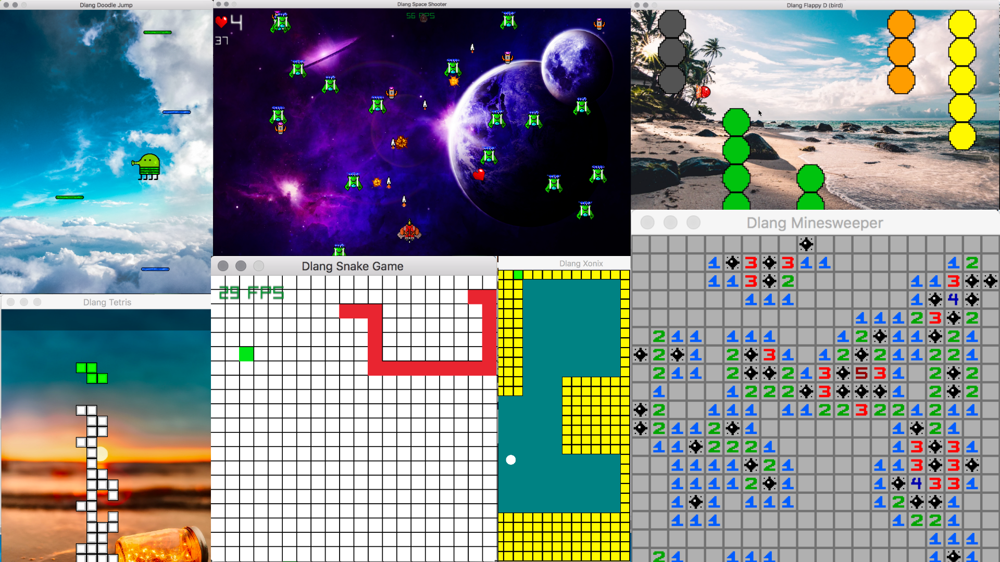

# Dlang Game Dev

The main purpose of this project is to inspire more people to use D programming language for their Game Dev projects, and to help newcomers and beginner programmers learn D language in a more engaging manner.

#### The following libraries are used:
- Raylib (raylib-d)
- SDL2 (bindbc-sdl)

#### Game resources (music, textures, images, etc...)
All of the game resources are either made by myself or downloaded from the internet under 'copyright free' lisence. All of the credits go to their respective creators. 

Use dub package manager to compile these games. It will include all the necessary packages/files for you. You can also follow my Dlang Game Dev tutorial at https://github.com/rillk500/Learn-Dlang-game-dev.

I’d love to hear your feedback and suggestions. If you have any questions regarding this project, send me an email: rillk500@gmail.com.

Enjoy!
